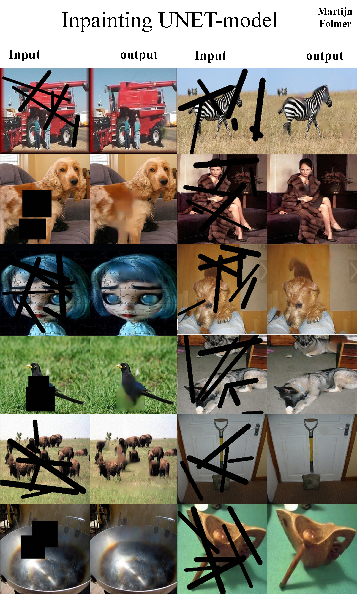

# Creating an inpainting generator model using a simple UNET architecture

This repository contains the python file to train a UNET model that can inpaint. Inpainting is when an image has certain parts of it missing, due to damage or because the user wishes to replace it, where the model then fills in these parts based on context and previous examples.

It works reasonably well (see below), but for the more complex patters, the inpainted parts do look a little smudgy. Given more time, you could probably increase the size of the generator model or vary the data set more to get even smoother results. In general, inpainting models will increase in efficacy if you train them on a dataset which resembles that which you want to inpaint. For example, if you want to inpaint images of peoples faces, you would do well to train a model on images of faces, so the model can learn what parts belong to a face.

Be aware that training a UNET can be very computationally heavy if you increase the size of the images too much. You can mitigate this by decreasing the batch size, or running it on a cloud service like AWS.

